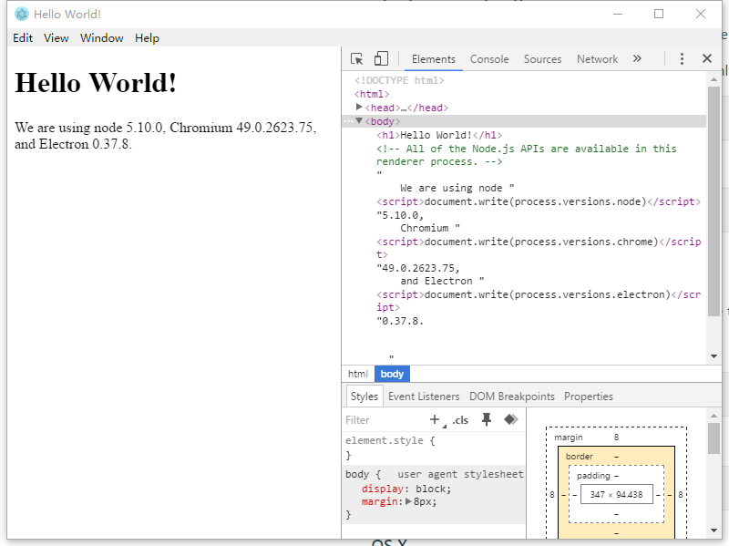

#Electron折腾记——getStart（1）#

##第一步，下载electron##
这个网址http://electron.atom.io/
下载Get started
这个东西下载下来就是一个这个，好像是一个向导之类的吧

然后按照提示clone一个简单的quick-start
'''
# Clone the Quick Start repository
$ git clone https://github.com/electron/electron-quick-start

# Go into the repository
$ cd electron-quick-start

# Install the dependencies and run
$ npm install && npm start
'''
##一个简单的electron结构##

- package.json
'''
{
  "name": "electron-quick-start",
  "version": "1.0.0",
  "description": "A minimal Electron application",
  "main": "main.js",
  "scripts": {
    "start": "electron main.js"
  },
  "repository": {
    "type": "git",
    "url": "git+https://github.com/electron/electron-quick-start.git"
  },
  "keywords": [
    "Electron",
    "quick",
    "start",
    "tutorial"
  ],
  "author": "GitHub",
  "license": "CC0-1.0",
  "bugs": {
    "url": "https://github.com/electron/electron-quick-start/issues"
  },
  "homepage": "https://github.com/electron/electron-quick-start#readme",
  "devDependencies": {
    "electron-prebuilt": "^0.37.8"
  }
}
'''
- main.js 

'''
const electron = require('electron')
const app = electron.app
const BrowserWindow = electron.BrowserWindow

let mainWindow

function createWindow () {
  
  mainWindow = new BrowserWindow({width: 800, height: 600})

  mainWindow.loadURL('file://' + __dirname + '/index.html')
 
  mainWindow.webContents.openDevTools()

  
  mainWindow.on('closed', function () {
    mainWindow = null
  })
}

app.on('ready', createWindow)
app.on('window-all-closed', function () {
  if (process.platform !== 'darwin') {
    app.quit()
  }
})

app.on('activate', function () {
  if (mainWindow === null) {
    createWindow()
  }
})

'''
- index.html 
'''
  <body>
    <h1>Hello World!</h1>
    <!-- All of the Node.js APIs are available in this renderer process. -->
    We are using node ,
    Chromium ,
    and Electron .
  </body>
'''
##运行app##
首先需要 npm electron-prebuilt
electron-prebuilt 是npm的模块，包含了ELectron的pre-compiled（这是什么东西？）.
  '''
如果是全局安装的 npm electron-prebuilt -g 
那么可以执行 electron . 运行electron
如果是本地安装的，那么在安装的node_modules的bin中运行
./node_modules/.bin/electron .

Windows
$ .\electron\electron.exe your-app\

执行效果
